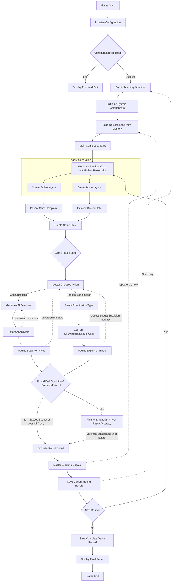

# 🏥 AI Doctor-Patient Diagnostic System

An AI doctor-patient diagnostic system based on the DeepSeek API, simulating real medical diagnosis scenarios through multi-agent collaboration, featuring a complete recording system and long-term learning mechanism.

## Inspiration and introduction
The inspiration is from my real medical experience, I noticed that patinets are always hard to decribe their symptoms accuratly, which make doctors hard to judge and force them ask quetion repeatly or let patients do many medical examinations. Both the medical time and cost of treatment will be increased greatly. Therefore, based on this inspiration, I make a AI Doctor-Patient Diagnostic System. It can continuously learns from each diagnostic rounds under the constraints such as limiting the number of symptom inquiries and the patient's budget. At the end, the agent doctor can diagnose diseases efficiently.

## ✨ Features
**Dual-Agent System**: Interactive diagnosis between Doctor AI and Patient AI

**Realistic Medical Simulation**: Complete process of consultation, examination, and diagnosis

**Intelligent Decision System**: Doctor AI intelligently selects examination items based on symptoms

**Long-Term Learning Mechanism**: AI doctor learns from historical games and optimizes diagnostic strategies

**Complete Recording System**: Saves detailed game records, round logs, and learning memories

**Rich Configuration**: 20+ disease library, 20+ examination items, 8 patient personality types

## 🏗️ Project Structure
```
main-dir/
├── readme.md
├── AI_doctor-patient_diagnostic_system-CN/ #Chinese version
    ├──doctor_memory/       # Doctor's long-term memory directory(The file it will be automatically generated after the first run)
    ├──medical_records/     # Game records directory (The file it will be automatically generated after the first run)
    ├──round_logs/          # Round logs directory (The file it will be automatically generated after the first run)
    ├──.env                 # Environment file
    ├──main.py              # Main program
    ├──requirements.txt     # Dependencies
├──AI_doctor-patient_diagnostic_system-EN/ #English version
    ├──doctor_memory/       # Doctor's long-term memory directory (The file it will be automatically generated after the first run)
    ├──medical_records/     # Game records directory (The file it will be automatically generated after the first run)
    ├──round_logs/          # Round logs directory (The file it will be automatically generated after the first run)
    ├──.env                 # Environment file
    ├──main.py              # Main program
    ├──requirements.txt     # Dependencies
```

## 🚀 Quick Start

### 1. Configure API Key

Create a .env file and add your DeepSeek API key

```bash
# .env file content
DEEPSEEK_API_KEY=your_api_key_here
```

**Getting API Key**:
1. Visit [DeepSeek Platform](https://platform.deepseek.com/)
2. Register and log in
3. Create a new API key in the "API Keys" page
4. Copy the API key and paste it into the .env file

### 2. Run the Game
**Interactive Mode** (Need to type enter to go to next round):
```bash
python main.py
# or
python3 main.py
```

**Auto Mode** (No interaction required):
```bash
python main.py --auto
# or
python3 main.py --auto
```

**Specify Number of Rounds**
```bash
python main.py --rounds 10  # Run 10 rounds
```

## 🎮 Game Rules

### Core Mechanics
**Doctor AI:**  
Has two possible actions:  
1. Ask the patient questions to gather more information. However, the patient's responses may be misunderstood, and this action will increase the patient's suspicion level.  
2. Request the patient to undergo tests, which is likely to yield accurate results but consumes the patient's budget.  

**Patient AI:**  
Answers questions based on their actual condition, but may provide misleading information due to misunderstandings. For example, they might consider having eaten a few hours ago as "fasting," or not regard drinking beer as "having consumed alcohol."  

**Trust System:**  
Asking questions increases the patient's suspicion level by 0.1, while requesting tests increases it by 0.05. Diagnosis is considered a failure if the suspicion level exceeds 1.  

**Budget System:**  
Each diagnosis session starts with a budget of 500 units. The patient sets an ideal budget, and the doctor must manage testing costs within this constraint. If the total expenses exceed the patient's ideal budget, the diagnosis is considered a failure.  

**Success Conditions:**  
Correct diagnosis + Reasonable cost + Patient's trust is maintained.

### Patient Personality Types (8 types)
| Personality    | Suspicion Growth | Cost Sensitivity | Ideal Cost Range |
|----------------|------------------|------------------|------------------|
| Cautious       | 0.15             | 0.8              | 80-150 RMB       |
| Casual         | 0.08             | 0.4              | 120-200 RMB      |
| Hypochondriac  | 0.25             | 0.3              | 150-250 RMB      |
| Frugal         | 0.12             | 0.9              | 50-100 RMB       |
| Impatient      | 0.20             | 0.5              | 100-180 RMB      |
| Dependent      | 0.05             | 0.6              | 200-300 RMB      |
| Rational       | 0.10             | 0.7              | 150-220 RMB      |
| Suspicious     | 0.30             | 0.4              | 80-120 RMB       |

### Examination Items (20+ types)
Including: Complete Blood Count, Urinalysis, Electrocardiogram, Chest X-ray, CT Scan, MRI, Ultrasound, Gastroscopy, Liver Function Test, Kidney Function Test, Blood Glucose Test, Lipid Profile, Bone Density Test, Endoscopy, Biopsy, EEG, Pulmonary Function Test, Skin Allergy Test, etc.

### Diseases (20+ types)
Migraine, Gastritis, Allergic Rhinitis, Common Cold, Hypertension, Diabetes, Asthma, Arthritis, Dermatosis, Insomnia, Pneumonia, Bronchitis, Gastric Ulcer, Kidney Stones, Cholecystitis, Myocarditis, Concussion, Lumbar Disc Herniation, Osteoporosis, Anemia, Hyperthyroidism, Gout, Hepatitis, Irritable Bowel Syndrome, Depression, Anxiety, Cataract, Glaucoma, Otitis Media, Sinusitis

## 🔄 System Workflow


## 🤖 AI System Details
### 1. Doctor Agent
**Goal:** Correctly diagnose disease, control costs, maintain patient trust
**Capabilities:**
- Intelligent questioning (based on conversation history reasoning)
- Intelligent examination selection (based on symptoms and relevance)
- Final diagnosis (comprehensive analysis of all information)
**Learning Mechanism:** Learns from each round's results, optimizes questioning and examination strategies

### 2. Patient Agent
**Goal:** Describe condition truthfully, but may have misunderstandings
**Characteristics:**
- Personality affects suspicion growth and cost sensitivity
- May misunderstand doctor's questions
- Actual condition hidden in descriptions

### 3. Medical System
**Examination Relevance:** Each examination has different diagnostic value for different diseases
**Accuracy Simulation:** Examination results may be true positive, true negative, false negative
**Cost System:** Different examinations have different costs, affecting patient trust

## 🧠 Long-term Learning System
AI doctor learns from each game and continuously optimizes diagnostic strategies:
1. **Game Review:** Automatically analyzes key decision points after each game
2. **Experience Extraction:** Extracts success/failure experiences for future reference
3. **Memory Storage:** Saves to JSON files in doctor_memory/ directory
4. **Experience Application:** Automatically loads historical experiences when starting new games

For example, the doctor learns:
- How to balance consultation and examination ratio
- Which examinations are most valuable for specific symptoms
- How to manage patient trust values
- Cost control optimization strategies

## 📊 Game Output Example
```
================================================================================
                            🩺 Patient 1 Consultation
================================================================================

【Patient Personality】Suspicious
【Ideal Cost】100 RMB
【Actual Condition】Diabetes

Patient Chief Complaint:
Patient: I've been feeling thirsty recently, drinking lots of water but still feeling dry mouth, urinating more frequently than before...

💬 Doctor Asks Questions
Doctor: How long has this thirst and frequent urination been going on? Have you tested your blood sugar?
Patient: About two to three weeks, haven't tested blood sugar, thought it was just not drinking enough water...

🔬 Doctor Requests Examination
Doctor: Recommend blood glucose test
Examination Result: Blood glucose test shows significantly elevated blood sugar, consistent with diabetes diagnosis criteria
Examination Cost: 50 RMB

🤔 Doctor Thinks About Final Diagnosis...
Doctor Diagnosis: Diabetes

✅ Consultation Successful!

📈 Learning Progress: Recent Success Rate: 100.0% | Average Questions: 1.0 | Average Examinations: 1.0

================================================================================
                            🎓 Game Final Report
================================================================================

Total Rounds: 5
Success Rate: 80.0%
Average Questions: 3.2
Average Examinations: 1.8
Average Cost: 215.4 RMB
Average Cost Ratio: 1.4

Doctor Learning Summary: Recent Success Rate: 80.0% | Average Questions: 3.2 | Average Examinations: 1.8
```

## ⚙️ Configuration
```python
# API Configuration
DEEPSEEK_API_KEY = os.getenv("DEEPSEEK_API_KEY", "")
DEEPSEEK_BASE_URL = "https://api.deepseek.com"
MODEL_NAME = "deepseek-chat"

# Game Basic Configuration
MAX_QUESTIONS_PER_ROUND = 12  # Maximum questions per round
INITIAL_BUDGET = 500          # Initial budget
SUSPICION_THRESHOLD = 0.8     # Suspicion threshold

# Disease Library (20 types)
DISEASE_LIBRARY = [
    "Migraine", "Gastritis", "Allergic Rhinitis", "Common Cold", "Hypertension", 
    "Diabetes", "Asthma", "Arthritis", "Dermatosis", "Insomnia",
    "Pneumonia", "Bronchitis", "Gastric Ulcer", "Kidney Stones", "Cholecystitis",
    "Myocarditis", "Concussion", "Lumbar Disc Herniation", "Osteoporosis", "Anemia"
]

# Long-term Memory
ENABLE_LONG_TERM_MEMORY = True  # Enable cross-game learning
MAX_HISTORY_GAMES = 10          # Save recent 10 games

# AI Temperature Parameters
TEMPERATURE_PATIENT_RESPONSE = 0.9    # Patient response - High temperature increases diversity
TEMPERATURE_DOCTOR_QUESTION = 0.7     # Doctor questions - Medium temperature balances professionalism and flexibility
TEMPERATURE_DOCTOR_DIAGNOSIS = 0.3    # Doctor diagnosis - Low temperature ensures accuracy
```

## 🧪 Testing & Validation
```
# Verify Python syntax
python3 -m py_compile main.py

# View help information
python3 main.py --help

# Run test game (3 rounds auto mode)
python3 main.py --auto --rounds 3
```

## 🔧 Customization & Extension
### Add New Diseases
1. Add disease name to DISEASE_LIBRARY in MedicalGameConfig class
2. Add relevant examination relationships to TEST_DISEASE_RELEVANCE in MedicalSystem class

### Add New Examination Items
1. Add new examination to TEST_COSTS and TEST_ACCURACY in MedicalGameConfig class
2. Define examination-disease relevance in TEST_DISEASE_RELEVANCE in MedicalSystem class
3. Add corresponding result description templates

### Adjust Patient Personalities
Modify PERSONALITY_TYPES in MedicalGameConfig class

```python
PERSONALITY_TYPES = {
    "New Personality": {
        "suspicion_gain": 0.15,     # Suspicion growth rate
        "cost_sensitivity": 0.8,    # Cost sensitivity
        "ideal_cost_range": (80, 150)  # Ideal cost range
    },
    # ... Existing personalities
}
```

## 🤝 Contributing
Welcome to submit Issues and Pull Requests!

## 📄 License
MIT License

## 🙏 Acknowledgments
- [DeepSeek](https://www.deepseek.com/) - Providing powerful AI API
- [OpenAI Python SDK](https://github.com/openai/openai-python) - Excellent API client
- [Colorama](https://github.com/tartley/colorama) - Cross-platform colored terminal output
```
